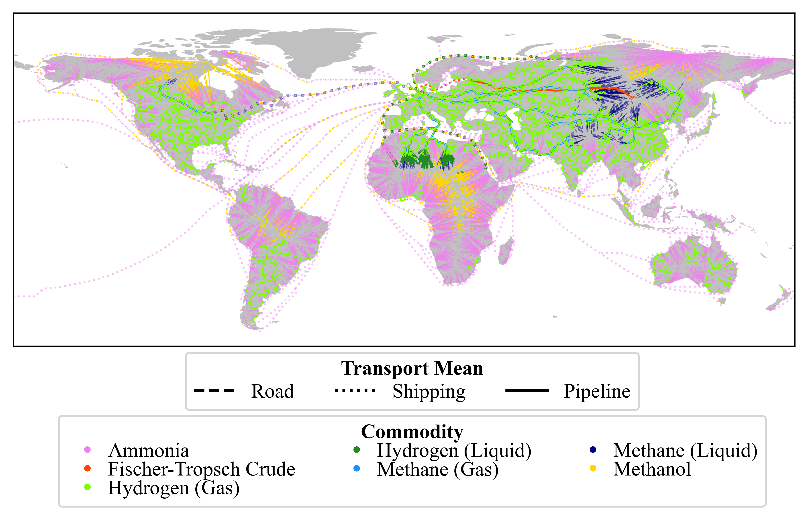
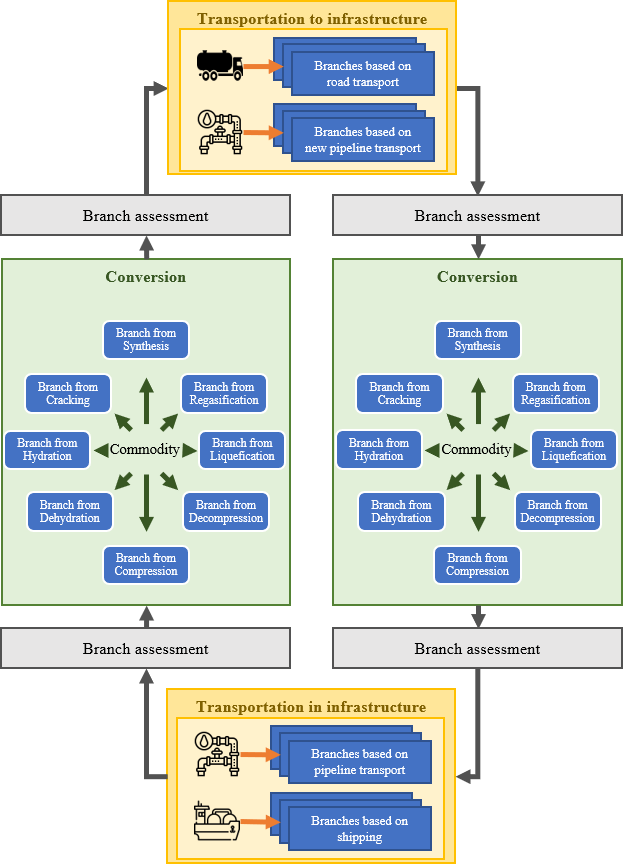

# HERMES: <ins>H</ins>ydrogen <ins>E</ins>conomy <ins>R</ins>outing <ins>M</ins>odel for cost-<ins>e</ins>fficient <ins>S</ins>upply

HERMES is a multi commodity multi mean of transport algorithm,
capable to find the most cost-effective transportation route from pre-defined starting points to a desired location.
The algorithm derives possible solutions for transportation from a starting point to the final destination.
Based on the underlying infrastructure data, the algorithm iteratively explores infrastructure nodes and calculates
costs for each reached node. It terminates as soon as it reaches the final destination and exploration
to other nodes is not possible anymore

  

# Following steps need to be taken to use PtX Transport:

1. Download this repository and create python project in your coding environment
2. Install requirements (in terminal: pip install -r requirements.txt)
3. Create project folder where data and results are stored (this does not have to be the same folder to place the code in)
4. Adjust "algorithm_configuration.yaml" (paths, parameters etc.) in this repository based on created dictionary and own configurations
5. (optional) Adjust the techno economic data in the "raw data" folder (in your project folder) if needed
6. Run "_1_script_process_raw_data.py" to get all infrastructure data
7. If you want to create random start locations, check respective configurations (algorithm_configuration.yaml) and run "_2_create_random_locations". Otherwise, place your own start locations in the folder
8. If you want to start the routing algorithm, run "_3_main.py"
9. If you want to plot the results, run "_4_plot_results.py". You can adjust plotting configuration in "plotting_configuration.yaml"

# Important things to consider:

- If techno-economic data and assumptions are changed, conversion costs need to be updated 
  - run "1_script_process_raw_data" and "2_create_random_locations" with the setting update_only_conversion_costs_and_efficiency = True
- Data processing is quite time-consuming and heavily depends on the resources of you computer
- The processed data will take quite some storage space (distances are not calculate if 'use_low_storage' = True)
  - Minimal example: 11 MB (without distances) | ~500 MB (with distances)
  - Full approach: 55 MB (without distances) | ~5 GB (with distances)
- The computational expenses heavily rely on the data and setting

# Citation

# Big thanks to

- genthalili's SeaRoute package (https://github.com/genthalili/searoute-py/tree/main)
- NetworkX: Aric A. Hagberg, Daniel A. Schult and Pieter J. Swart, “Exploring network structure, dynamics, and function using NetworkX”, in Proceedings of the 7th Python in Science Conference (SciPy2008), Gäel Varoquaux, Travis Vaught, and Jarrod Millman (Eds), (Pasadena, CA USA), pp. 11–15, Aug 2008
