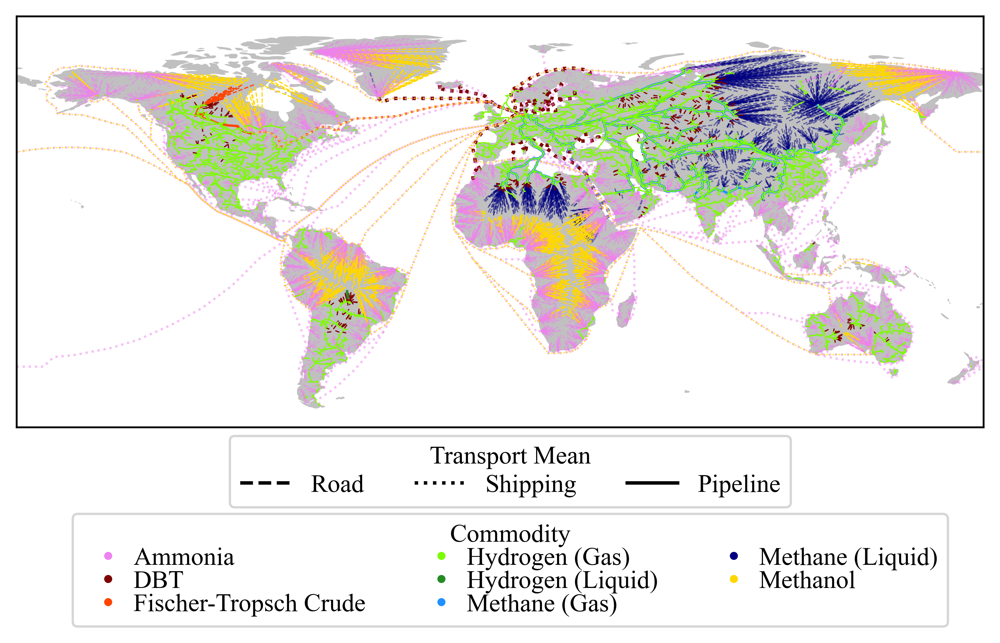
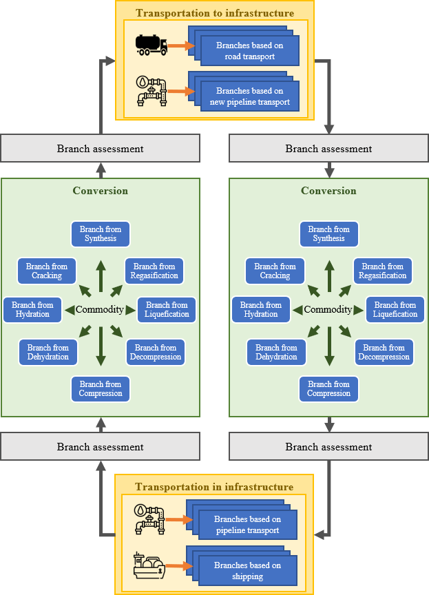

PtX transport is a multi commodity multi mean of transport algorithm,
capable to find the most cost-effective transportation route from pre-defined starting points to a desired location.
The algorithm derives possible solutions for transportation from a starting point to the final destination.
Based on the underlying infrastructure data, the algorithm iteratively explores infrastructure nodes and calculates
costs for each reached node. It terminates as soon as it reaches the final destination and exploration
to other nodes is not possible anymore.

  

Following steps need to be taken to use PtX Transport:
-

1. Download this repository and create python project in your coding environment
2. Install requirements
3. Create following directory structure

    project folder/
    |
    +---raw data/
    +---processed data/
    +---results/
        |
        +---location_results/
        +---plots/

4. Adjust "algorithm_configuration.yaml" (paths, parameters etc.) in this repository
5. Move raw data from data folder in this repository to the created raw data folder. Alternatively, place your own raw data in the raw data folder
6. If you want to create start locations, check respective configurations and run "data_processing/_1_create_random_locations"
7. If you need to process raw data, run "data_processing/_2_script_process_raw_data.py". Alternatively, you can place your processed data in the processed data folder
8. If you want to start the routing algorithm, run "algorithm/main.py"
9. If you want to plot the results, run "plotting/plot_results.py"

Important things to consider:
-
- Data processing is quite time-consuming and heavily depends on the resources of you computer
- The processed data will take quite some storage space
  - Minimal example: 1.69 GB | Full approach: 
- The computational expenses heavily rely on the data and setting

Citation
Big thanks to
